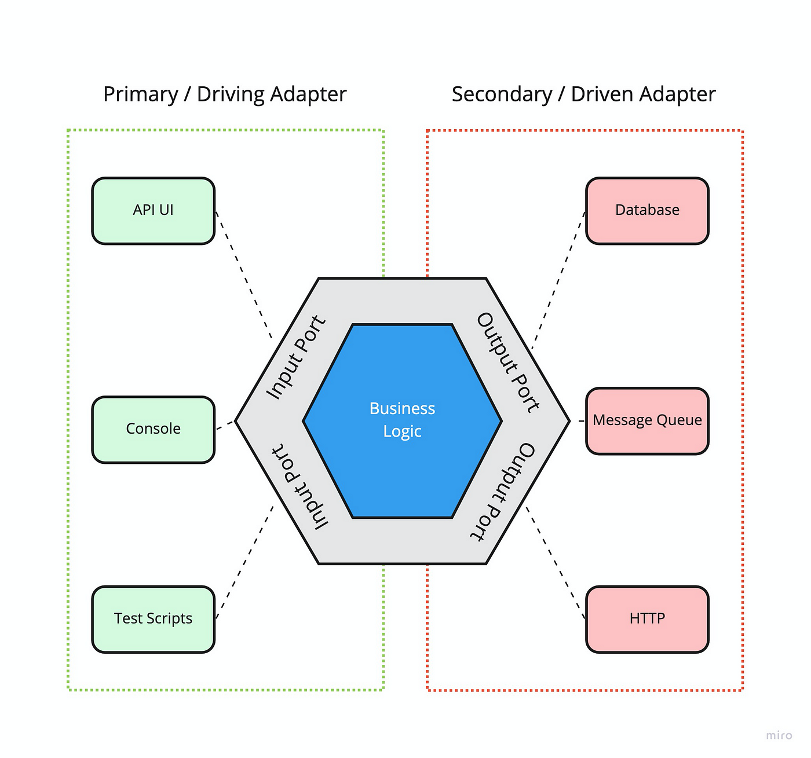

# How to read / update tests

Testing an app is an essential part of the development process.
It helps to ensure that the app is working as expected and can be used as living documentation.

I discovered that three types of tests are needed to use TDD along with BDD.

## Hexagonal architecture

This documentation is based on the premise that you have a minimal amount of knowledge about
software design and in
particular, the Hexagonal Architecture.

## Types of tests

### Acceptance tests (End-to-end aka E2E)

[//]: # (These tests are written in [Gherkin]&#40;https://cucumber.io/docs/gherkin/reference&#41;, are located in the)

[//]: # (features [folder]&#40;../features&#41; and have the `.feature` extension.)
E2E tests will check primary adapters using secondary adapters and business rules.

You will launch your whole app without mocking anything

#### Steps

In a E2E test of your HTTP controller:

**Given** steps will prepare the query as well as the database;

**When** steps will send the request to your

**Then** steps:

- Should expect the HTTP response.
- Should expect 4XX HTTP errors : params validation, permissions, unknown entity, etc.

### Integration tests

Integration tests will check secondary adapters using business rules.

You will execute your command or your use-case without mocking anything either.

The goal is to check if your secondary adapters are doing their job, you don't have to check every
branches of your
use-case.
You should only test the branches that imply calling your secondary adapters differently.

#### Steps

**Given** steps will prepare the database;

**When** steps will execute your command / use-case;

**Then** steps:

- Should expect the database's state;
- Should expect your mail provider to have received a request;

### Unit tests

[//]: # (TODO)

## The development cycle

### Acceptance tests

First create a new ".feature" file inside the feature [folder](../tests) and make it fail.

### Unit tests

Then create or update the .spec file right next to the tested file and make it fail.

### Minimal code

Then write the minimal code to make the unit test succeed.

_Repeat from the [unit tests](#unit-tests) step until your acceptance test succeed._

### Refactor

Then you refactor your code to make it easy to read and scalable.
It's easily doable since your tests are here to ensure that your code is still working as expected.
